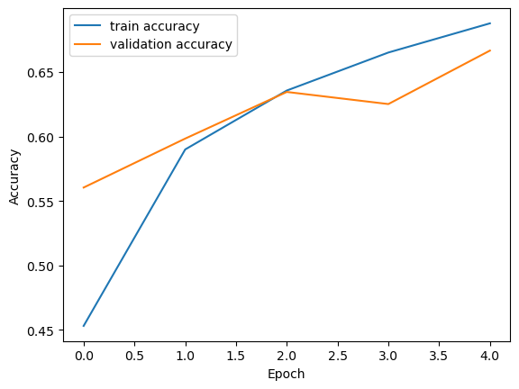
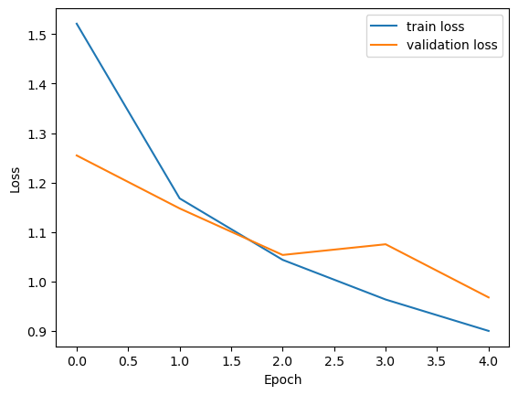
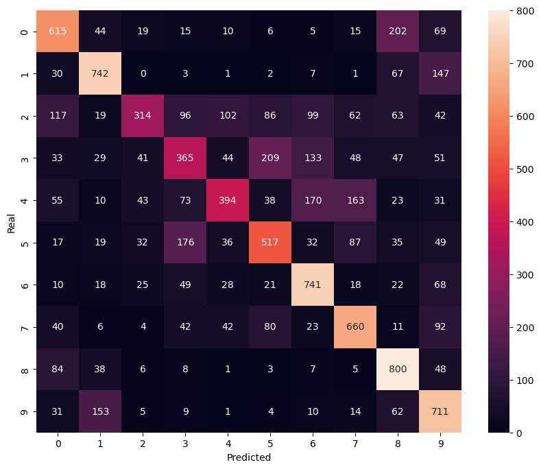
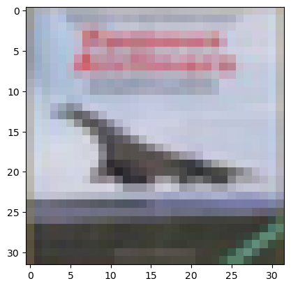

# CIFAR-10 Image Classification

One of my first Computer Vision projects developed during my MSc in Artificial Intelligence.

This project explores image classification using Convolutional Neural Networks (CNNs) and Transfer Learning with MobileNetV2 on the CIFAR-10 dataset.

---

## 📊 Dataset

The CIFAR-10 dataset contains:

- 60,000 RGB images
- 10 image classes
- 32x32 image resolution

Classes:

- Airplane
- Automobile
- Bird
- Cat
- Deer
- Dog
- Frog
- Horse
- Ship
- Truck

---

## 🧠 Project Workflow

1. Dataset Loading
2. Data Exploration
3. Data Preprocessing
4. Baseline CNN Development
5. Data Augmentation
6. Error Analysis
7. Transfer Learning with MobileNetV2
8. Model Evaluation

---

## 🔬 Techniques Used

- Convolutional Neural Networks (CNNs)
- Data Augmentation
- One-Hot Encoding
- Functional API
- Transfer Learning
- MobileNetV2
- Confusion Matrix
- Error Analysis

---

## 📈 Results

| Model              | Accuracy |
| ------------------ | -------- |
| Baseline CNN       | 66.79%   |
| CNN + Augmentation | 58.59%   |
| Functional API CNN | 54.20%   |
| MobileNetV2        | 80.09%   |

Transfer Learning with MobileNetV2 significantly improved performance compared to the baseline CNN model.

---
## 🖼️ Visual Results

### Training Accuracy



### Training Loss



### Confusion Matrix



### Sample Prediction



---

## 🛠️ Technologies

- Python
- TensorFlow
- Keras
- NumPy
- Matplotlib
- Jupyter Notebook

---

## 🚀 Future Improvements

- Experiment with EfficientNet
- Experiment with ResNet50
- Hyperparameter Tuning
- Model Explainability (Grad-CAM)
- Fine-tuning pretrained models

---

## 📁 Repository Structure

```text
cifar10-image-classification/
│
├── images/
│   ├── cifar10_training_accuracy.png
│   ├── cifar10_training_loss.png
│   ├── cifar10_confusion_matrix.png
│   └── cifar10_sample_prediction.png
│
├── cifar10-image-classification.ipynb
└── README.md
```

---

## 👩‍💻 Author

Evangelia Karka

MSc Artificial Intelligence
Metropolitan College (University of East London)
